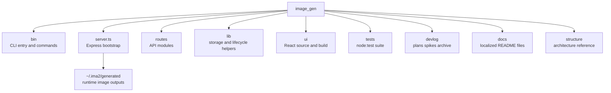

# File And Function Map

LAN access owners: `lib/localAccessPolicy.ts` parses serving origins and request
Host/Origin; `lib/lanSessionStore.ts` owns digest sessions, expiry and bootstrap
failure limits; `lib/localLanAccess.ts` owns authentication/session routes and
response revocation, and decides the token gate per connection: binding past
loopback turns it on, but a request arriving from 127.x/::1 is exempt unless
`IMA2_LAN_TOKEN_ON_LOOPBACK` forces it; `lib/generatedMediaAccess.ts` applies media privacy and static
serving. `server.ts` wires one instance and disposes it before HTTP close. CLI
destination binding remains in `bin/lib/client.ts`, browser state in `lanSession.ts`.

This document is a fast map of the current `ima2-gen` file layout. Use it to understand which files own which responsibilities before making changes.

The map matters because the repository looks small, but runtime responsibility is split across several areas. `server.js` is now a small bootstrap file, API ownership lives in `routes/*`, and runtime helpers live in `lib/*`. The CLI is split into `bin/commands/*`, and the UI is split across `ui/src/components/*`, `ui/src/lib/*`, and `ui/src/store/useAppStore.ts`. Reading responsibilities and line counts together helps reveal both impact radius and refactor targets.

Snapshot note, 2026-09-05: TypeScript is source of truth for `server`, `config`, `routes/*`, `lib/*`, and `bin/*`. Paired `*.js` files are generated runtime outputs ignored in the current checkout, produced by `tsc -p tsconfig.build.json` (server/lib/routes), `tsc -p tsconfig.bin.json` (CLI), and `prepack`; do not edit them by hand. Line counts refer to the `.ts` source unless otherwise noted. CLI parity #61 added provider overrides, multimode refs/mode, multimode inflight help, server-side favorites listing, and source-contract tests.

Snapshot note, 2026-06-28 (v2.0.4): full `lib/*`, `bin/commands/*`, `bin/lib/*`, `routes/*`, and selected `ui/src/lib/*` line counts refreshed via `npm run docs:refresh-line-counts` (`scripts/refresh-structure-line-counts.mjs`). Contract tests: `tests/structure-line-counts-contract.test.js`, `tests/api-docs-contract.test.js`.

Before adding a feature, choose the surface first. For CLI work, read `bin/` and `[[02-command-reference]]`. For API work, read `server.ts`, `routes/*.ts`, `lib/*.ts`, and `[[03-server-api]]`. For UI work, read `ui/src/` and `[[04-frontend-architecture]]`. For graph workflow work, also read `[[05-node-mode]]`.

---

## Top-Level Tree



## Core File Line Counts

### Current Route Source Layout

```text
routes/
  annotations.ts        GET/PUT/DELETE /api/annotations/:filename
  canvasVersions.ts     POST/PUT /api/canvas-versions
  comfy.ts              POST /api/comfy/export-image
  edit.ts               POST /api/edit
  events.ts             GET /api/events — SSE multiplexing endpoint
  generate.ts           POST /api/generate
  multimode.ts          POST /api/generate/multimode
  nodes.ts              POST /api/node/generate, GET /api/node/:nodeId
  sessions.ts           /api/sessions* + graph + style-sheet
  history.ts            /api/history* + favorite/delete/restore/permanent
  imageImport.ts        POST /api/history/import-local
  health.ts             providers/health/oauth/inflight/billing
  storage.ts            storage status/open generated dir
  metadata.ts           POST /api/metadata/read
  capabilities.ts       GET /api/capabilities, GET/PATCH /api/config/grok-planner
  keys.ts               GET/PUT/DELETE /api/keys/:provider, /api/keys/vertex
  auth.ts               POST /api/auth/switch, GET /api/auth/switch/:sessionId
  quota.ts              GET /api/quota
  grok.ts               GET /api/grok/status (live api.x.ai probe with the stored xAI session)
  agy.ts                GET /api/agy/status + Antigravity CLI bridge
  prompts.ts            prompt CRUD/folders/import/export
  promptImport.ts       curated/discovery/folder/preview/commit import routes
  generationRequestLog.ts GET /api/generation-requests (#95)
  agent.ts              /api/agent/* sessions turns queue
  promptBuilder.ts      POST /api/prompt-builder/chat
  video.ts              POST /api/video/generate SSE
  videoExtended.ts      video edit/extend/frame/analyze helpers
  index.ts              route registration hub
```

| File | Lines | Responsibility |
|---|---:|---|
| `server.ts` | 570 | Express bootstrap, middleware wiring, OAuth startup, runtime advertisement, port fallback, post-listen MCP restore, coordinated shutdown, route registration, static serving |
| `config.ts` | 527 | Centralized runtime config (env > `~/.ima2/config.json` > defaults), prompt import/index caps, web-search/reasoning-effort defaults, API-provider defaults, and backward-compatible flat re-exports |
| `routes/index.ts` | 99 | Route registration hub: health, capabilities, events, storage, metadata, history, imageImport, sessions, edit, nodes, multimode, generate, agent, prompt builder, generationRequestLog, annotations, canvasVersions, comfy, prompts, prompt import, keys, auth, quota, grok, agy, video, videoExtended, mcpMultishot, and (when `features.cardNews`) cardNews |
| `routes/mcpMultishot.ts` | 116 | Multishot (multi-scene) video generation route via Runway MCP |
| `routes/capabilities.ts` | 47 | `GET /api/capabilities` — agent-facing runtime defaults; `GET/PATCH /api/config/grok-planner` — Grok planner model query/update |
| `routes/generate.ts` | 13 | Classic generation API route wiring |
| `routes/edit.ts` | 416 | Edit API, mask validation, cancellation, OAuth/API edit response save, alpha verification (alphaVerified/alphaReason), provider/web-search/reasoning-effort plumbing |
| `routes/multimode.ts` | 10 | `POST /api/generate/multimode` route wiring |
| `routes/video.ts` | 684 | `POST /api/video/generate` SSE: Grok video T2V/I2V/Ref2V, active prompt guard, continuation lineage, sidecar persistence |
| `routes/videoExtended.ts` | 487 | Video edit, extension, frame extraction, and configured-planner first/last-frame analysis (Grok 4.5 default) |
| `routes/nodes.ts` | 28 | Node generation and node fetch route wiring |
| `routes/sessions.ts` | 318 | SQLite-backed session list/load/save/rename/delete, style-sheet get/put/enable/extract, graph save |
| `routes/history.ts` | 234 | History list, cursor pagination, favorites-only filtering, grouped gallery, soft delete (OS trash), restore, gallery favorite toggle, permanent delete |
| `routes/imageImport.ts` | 38 | `POST /api/history/import-local` raw image upload (PNG/JPEG/WebP) — Phase 10 drop-import for Canvas |
| `routes/health.ts` | 124 | Providers, health, OAuth status, inflight list/cancel for classic/node/multimode jobs, billing |
| `routes/mcpConnections.ts` | 164 | MCP provider list/status/connect/callback/refresh/disconnect/model routes; truthful state-to-HTTP mapping and secret-free responses |
| `routes/storage.ts` | 48 | Gallery storage status and generated-folder open action |
| `routes/metadata.ts` | 81 | `/api/metadata/read` for embedded XMP image metadata extraction |
| `routes/annotations.ts` | 119 | `GET/PUT/DELETE /api/annotations/:filename` for canvas annotation overlays |
| `routes/canvasVersions.ts` | 100 | `POST/PUT /api/canvas-versions` for canvas version snapshots |
| `routes/comfy.ts` | 222 | Comfy workflow inspect/register/list/delete/probe plus `POST /api/comfy/export-image`; media-kind inference and mismatch validation |
| `routes/models.ts` | 546 | Canonical runtime model catalog; Comfy image/video workflow partition and model-level execution locks |
| `routes/prompts.ts` | 429 | Prompt library CRUD, favorites, import/export, and folder management |
| `routes/promptImport.ts` | 380 | Prompt library preview/commit import API plus PR2 curated search, PR3 GitHub folder browse/preview, and PR4 discovery review endpoints |
| `routes/cardNews.ts` | 213 | Dev-gated card-news templates, sets, drafts, jobs, regenerate, export (only registered when `config.features.cardNews`) |
| `routes/generationRequestLog.ts` | 19 | `GET /api/generation-requests` — ring buffer of last 200 generation attempts (#95) |
| `lib/generationRequestLog.ts` | 44 | In-memory generation request log store |
| `routes/agent.ts` | 331 | Agent Mode API — sessions, turns, durable queue, compact, manifest, tools (`/api/agent/*`); backed by `lib/agent*.ts`; no CLI wrapper |
| `routes/promptBuilder.ts` | 107 | `POST /api/prompt-builder/chat` plus `GET/PUT /api/prompt-builder/config`; chat uses `lib/promptBuilder/*`, config persists the backend/model pair, and `ima2 prompt build` wraps chat |
| `routes/events.ts` | 152 | `GET /api/events` — SSE multiplexing endpoint; single persistent stream for all async job progress; ring replay + `replay-gap` + heartbeat; serializes `jobSeq` and the job envelope |
| `lib/eventBus.ts` | 152 | Global pub/sub event bus with ring buffer (2000), monotonic `seq`, per-job `jobSeq` (LRU-bounded), `replaySince`, `hasReplayGap` |
| `lib/ssePublish.ts` | 33 | `publishJobEvent` — suppress late done/error after retained cancel or tracking expiry, plus publish-time envelope snapshot |
| `lib/eventsPolicy.ts` | 10 | Pure SSE drain deadline and accepted cursor parsing; no runtime configuration |
| `lib/jobs/terminalStore.ts` | 79 | Terminal snapshot disk read/write/reap and per-ID admission cleanup; no inflight import |
| `ui/src/lib/eventChannel.ts` | 233 | Browser singleton `EventSource` for `/api/events`; exponential backoff reconnect; `subscribe(jobId)` routing; connection state callbacks; `armStreamTimeout`; `ensureConnected` |
| `ui/src/lib/sseStreamError.ts` | 77 | Shared `parseSseErrorPayload` — normalizes flat/nested SSE error shapes |
| `bin/ima2.ts` | 563 | CLI setup, serve, status, doctor, open, reset, command dispatch (`serve --dev` enables verbose diagnostics) |
| `bin/commands/gen.ts` | 413 | CLI image-generation client with references, provider override, model, mode, moderation, web-search, reasoning-effort, session, timeout recovery, background preset (`--bg`), `--character` (MCP lanes), and output-dir options |
| `bin/commands/edit.ts` | 168 | CLI image-edit client with provider override, model, mode, moderation, web-search, reasoning-effort, session, timeout recovery, and output options |
| `bin/commands/vectorize.ts` | 110 | Local CLI raster-to-SVG tracing; no server or provider roundtrip |
| `bin/commands/multimode.ts` | 220 | CLI multimode SSE client with provider override, references, prompt mode, incremental image save, timeout recovery, web-search, reasoning-effort, and session options |
| `bin/commands/node.ts` | 179 | CLI node-mode generate/show client with references, provider override, parent node, web-search, reasoning-effort, and SSE support |
| `bin/commands/session.ts` | 283 | CLI session list/load/save/rename/delete client |
| `bin/commands/history.ts` | 147 | CLI history mutation client for favorite/import/restore/delete/permanent actions |
| `bin/commands/prompt.ts` | 493 | CLI prompt library list/show/save/delete/import/export client |
| `bin/commands/annotate.ts` | 120 | CLI annotation read/write/delete client |
| `bin/commands/canvas-versions.ts` | 81 | CLI canvas version list/save client |
| `bin/commands/metadata.ts` | 49 | CLI image metadata read client |
| `bin/commands/comfy.ts` | 304 | CLI ComfyUI export and workflow inspect/register/list/delete; image/video kind and catalog-only video copy |
| `bin/commands/models.ts` | 101 | Human/JSON model catalog with lane/kind/id/label/lane status/model lock status/capabilities |
| `bin/lib/modelResolver.ts` | 189 | CLI model target resolution, kind/lane/default validation, model-level execution lock enforcement |
| `bin/commands/cardnews.ts` | 250 | CLI dev-gated card-news client |
| `bin/commands/config.ts` | 194 | CLI config get/set client |
| `bin/commands/observability.ts` | 177 | Shared CLI handler for `storage`, `billing`, `providers`, `oauth`, and `inflight` aliases (`ima2.ts` routes those commands here) |
| `bin/commands/doctor.ts` | 310 | CLI diagnostics: storage, OAuth, providers, image probe |
| `bin/commands/grok.ts` | 252 | Grok OAuth login and status helpers |
| `bin/commands/defaults.ts` | 270 | CLI default provider/model/size/reasoning-effort get/set |
| `bin/commands/capabilities.ts` | 143 | CLI wrapper for `GET /api/capabilities` |
| `bin/commands/skill.ts` | 402 | CLI packaged-skill reader: `skill [ls|<name>] [path] [--json]` over KNOWN_SKILLS (ima2/front/uiux) |
| `bin/commands/backfillThumbs.ts` | 35 | Gallery thumbnail backfill command |
| `bin/commands/cancel.ts` | 49 | Inflight cancel client |
| `bin/commands/ls.ts` | 65 | History list client (legacy alias); supports session and server-side favorites filtering via `favoritesOnly=1` |
| `bin/commands/ps.ts` | 82 | Inflight job list client, including optional terminal job snapshots; accepts arbitrary `kind` and documents `classic|node|multimode` |
| `bin/commands/show.ts` | 77 | Single history item display/reveal client |
| `bin/commands/video.ts` | 420 | Video CLI surface: generate, edit, extend, frame, analyze, `--character` (MCP lanes), and branch-local `continue` |
| `bin/commands/ping.ts` | 32 | Server health probe client |
| `bin/lib/client.ts` | 298 | Server discovery, HTTP request wrapper (connection: close, cleared timeouts), response normalization |
| `bin/lib/platform.ts` | 132 | Browser-open and binary-resolution helpers |
| `bin/lib/args.ts` | 97 | Dependency-free argv parser |
| `bin/lib/files.ts` | 40 | Data URI file conversion and output naming |
| `bin/lib/output.ts` | 123 | Terminal output, JSON, exit-code mapping, natural-exit (no process.exit — Windows safe) |
| `bin/lib/error-hints.ts` | 24 | CLI error hint formatting |
| `bin/lib/star-prompt.ts` | 130 | CLI GitHub star prompt helper |
| `bin/lib/interactive-confirm.ts` | 129 | Inline yes/no selector (arrow keys, `y`/`n`, Enter) with a typed fallback |
| `bin/lib/agent-driven.ts` | 35 | Agent/CI harness detection so consent prompts defer to the user |
| `bin/lib/storage-doctor.ts` | 40 | CLI storage doctor formatting |
| `bin/lib/sse.ts` | 186 | CLI SSE response stream helper |
| `bin/lib/browser-id.ts` | 17 | CLI browser-id header helper |
| `lib/sessionStore.ts` | 322 | SQLite session and graph persistence, graph parent normalization, style-sheet helpers, session-title lookup |
| `lib/styleSheet.ts` | 140 | Session style-sheet extraction and prefix composition |
| `lib/assetLifecycle.ts` | 198 | Soft delete (OS trash via `trash` dep), restore, node asset-missing marking |
| `lib/systemTrash.ts` | 21 | Cross-platform OS-trash helper wrapping the `trash` dependency |
| `lib/db.ts` | 440 | SQLite bootstrap and migrations (schema 7): sessions, nodes, edges, inflight, terminal jobs, idempotency keys, prompts, prompt folders, canvas versions |
| `lib/nodeStore.ts` | 107 | Node image and metadata load/save |
| `lib/inflight.ts` | 457 | SQLite-backed active job registry for classic/node/multimode, abort controllers, cancel state, and terminal job snapshots that survive a restart |

Tracker expiry writes its terminal and deletes the active row transactionally.
Retained outcomes dominate residual cleanup; controllers and the in-memory cache
remain owned by inflight. `ui/src/store/inflightReconciliation.ts` owns request-local
scope/revision/identity reconciliation shared by polling and reload actions.
| `lib/logger.ts` | 171 | Safe structured logging, redaction, level filtering, and test sink helpers |
| `lib/requestLogger.ts` | 50 | API-only request lifecycle logging and sanitized request ID middleware |
| `lib/codexDetect.ts` | 154 | Codex OAuth session detection helper |
| `lib/packageCli.ts` | 54 | Package-local dependency CLI resolution and Node invocation contract |
| `lib/errorClassify.ts` | 110 | Upstream/OAuth error classifier for stable error codes, including provider validation errors |
| `lib/generationErrors.ts` | 262 | Generation error normalization, retry classification, status mapping |
| `lib/historyList.ts` | 200 | History reconstruction from generated assets, sidecars, embedded XMP metadata fallback, session-aware rows |
| `lib/videoContinuity.ts` | 193 | Video active-prompt guard, generated video sidecar lineage read/normalize/append, max-4 continuity retention, planner context formatting |
| `lib/videoFrameExtract.ts` | 100 | Generated-dir-safe MP4 validation and ffmpeg frame extraction for video frame/analyze/continue workflows |
| `lib/videoGenerationRequest.ts` | 166 | Shared generate-request contract: mode inference, mutually-exclusive source guard, and duration/resolution/aspect defaults for UI, CLI, agent, and route |
| `lib/grokVideoAdapter.ts` | 519 | Grok video planner and xAI video generation adapter, including continuity-aware prompt planning and model fallback metadata |
| `lib/grokVideoShared.ts` | 153 | Shared Grok video types, config, endpoint, and timeout helpers keeping the adapter/poll dependency one-way |
| `lib/grokVideoPoll.ts` | 118 | Grok video status polling with transient-failure tolerance so a network blip cannot discard a long render |
| `lib/localImportStore.ts` | 115 | Validates raw PNG/JPEG/WebP body, writes timestamped `imported-*` to generated/, embeds XMP metadata, returns GenerateItem-shaped row |
| `lib/storageMigration.ts` | 311 | Legacy generated-folder scan and migration support |
| `lib/runtimePorts.ts` | 106 | Port probing, fallback binding, and OAuth ready URL parsing |
| `lib/mcp/tokenStore.ts` | 325 | Versioned 0600 MCP token records, endpoint/origin binding inspection, revision/tombstone CAS, and PID+nonce recovery lock |
| `lib/mcp/oauthProvider.ts` | 150 | SDK OAuth provider, memory-only PKCE/state, bound credential persistence, scoped invalidation, and legacy binding migration |
| `lib/mcp/connectionRuntime.ts` | 124 | MCP session/connection identity helpers, restore inspection, terminal/session-invalid error classification, and bounded concurrency |
| `lib/mcp/connectionManager.ts` | 536 | Generation/epoch-safe connect, callback, refresh, disconnect, post-listen restore, budgeted auto-reconnect (3 consecutive drops without RPC), tool calls (with error content capture), and shutdown |
| `lib/mcp/characterRefs.ts` | 41 | Character provider binding resolution for MCP generate — element load, binding validation, refs expansion without trimming |
| `lib/mcp/shutdown.ts` | 24 | Post-listen restore activation plus concurrent HTTP/MCP shutdown coordination and grace bound |
| `lib/mcp/snapshotPipeline.ts` | 113 | Generation/epoch-safe live tool snapshot ingest and stale-result suppression |
| `lib/oauthLauncher.ts` | 119 | OAuth proxy child process startup and actual ready-port capture |
| `lib/oauthProxy.ts` | 4 | Re-export shim for the `lib/oauthProxy/` subtree (kept for callers that imported the original module path) |
| `lib/oauthProxy/index.ts` | 29 | Public surface — re-exports generators, streams, prompts, references, runtime, and shared types |
| `lib/oauthProxy/generators.ts` | 229 | OAuth Responses single-image generation and stable generator exports |
| `lib/oauthProxy/multimodeGenerators.ts` | 304 | OAuth Responses multimode and edit generators, masked-edit guard |
| `lib/generatePipeline.ts` | 724 | Classic admission/idempotency, shared execution facade, persistence, background-preset prompt shaping, and event publication |
| `lib/backgroundPresets.ts` | 78 | Background preset contract for asset generation: enum parse, prompt suffixes, planner constraint |
| `lib/multimodePipeline.ts` | 522 | Multimode streaming pipeline, persistence, cancellation, and partial timeout |
| `lib/comparisonMatrix.ts` | 77 | Prompt-locked comparison axes: deterministic cartesian expansion, 9-cell cost cap, varying-axis labels |
| `lib/comparisonRunner.ts` | 111 | Per-cell generation orchestrator with bounded concurrency, isolated failures, single-cell retry, and two-level cancel |
| `lib/nodeGeneration.ts` | 551 | Node admission and execution facade, caller-owned retry, persistence, and SSE publication |
| `lib/nodeValidation.ts` | 49 | Node prompt, references, and moderation validation |
| `lib/oauthProxy/streams.ts` | 233 | SSE/event-stream helpers and safe stream diagnostics |
| `lib/oauthProxy/prompts.ts` | 158 | Prompt assembly with injected `SAFETY_INTENT_POLICY` from `lib/promptSafetyPolicy.ts` |
| `lib/oauthProxy/references.ts` | 46 | Reference image preparation and validation for the OAuth path |
| `lib/oauthProxy/runtime.ts` | 116 | OAuth runtime context and request execution |
| `lib/oauthProxy/errors.ts` | 129 | OAuth-specific error codes and normalization |
| `lib/oauthProxy/types.ts` | 10 | Shared OAuth proxy types (re-exported from `index`) |
| `lib/promptSafetyPolicy.ts` | 3 | `SAFETY_INTENT_POLICY` constant: 3-line intent policy injected by oauthProxy/prompts and the API-key Responses adapter |
| `lib/responsesImageAdapter.ts` | 6 | Compatibility re-exports of the three OpenAI operations; existing agent/sprite imports remain valid |
| `lib/responsesTransport.ts` | 248 | Responses endpoint/auth/readiness, redacted errors, abort/timeout and JSON/SSE parser boundary |
| `lib/providers/adapters/openaiTypes.ts` | 29 | Original positional-operation reference/options types, unchanged optional fields |
| `lib/providers/adapters/openaiOperations.ts` | 235 | Actual OpenAI generate/edit/multimode operation bodies and reference normalization |
| `lib/providers/adapters/openaiExecution.ts` | 142 | Typed four-surface OpenAI owner, classic retry and native callback/result mapping |
| `lib/providerOptions.ts` | 161 | Per-provider option assembly; rejects catalog-only Comfy video workflows on the classic image path |
| `lib/runtimeContext.ts` | 220 | Per-request runtime context plumbing for routes and lib helpers |
| `lib/errInfo.ts` | 44 | Error info shape and helpers shared across routes/lib |
| `lib/oauthNormalize.ts` | 31 | Upstream OAuth response field normalization |
| `lib/openDirectory.ts` | 48 | Cross-platform open of the generated directory (used by `/api/storage/open-generated-dir`) |
| `lib/refs.ts` | 165 | Reference image validation, count/size limits |
| `lib/referenceImageCompress.ts` | 85 | Sharp-based reference image compression below the configured byte cap |
| `lib/imageModels.ts` | 396 | Image model allowlist and `normalizeImageModel(ctx, raw)` helper |
| `lib/imageMetadata.ts` | 124 | `ima2.generation.v1` payload schema, XMP build/parse, embed limits |
| `lib/imageMetadataStore.ts` | 68 | Sharp-based embed/read of XMP metadata into PNG/JPEG/WebP |
| `lib/canvasVersionStore.ts` | 359 | Canvas version snapshot storage, list, restore, and pruning |
| `lib/comfyBridge.ts` | 266 | ComfyUI bridge: workflow export, image staging, integration helper handoff |
| `lib/naiImageAdapter.ts` | 255 | NovelAI image-generation provider adapter: request build, V5 parameter gating, ZIP-to-PNG handoff, and 15 `NAI_*` operational error codes |
| `lib/naiOptions.ts` | 145 | NovelAI request-option normalizer shared by every request-driven dispatch, plus negative-prompt history provenance |
| `lib/naiZip.ts` | 153 | Minimal ZIP reader for NovelAI responses: stored/deflate entries, ZIP64 and encryption refusal, 50MB entry cap |
| `lib/providers/adapters/nai.ts` | 142 | NovelAI provider-registry adapter binding: capability declaration and `normalizeError` mapping |
| `lib/providers/registry.ts` | 287 | Provider lane manifests: the single declaration every generated catalog, capability list, and CLI enum derives from |
| `lib/providers/types.ts` | 95 | Manifest/credential types, explicit model generation support, and provider surface records |
| `lib/providers/derive.ts` | 97 | Registry-bound provider IDs, catalogs, reference limits and surface support |
| `lib/providers/surfaceSupport.ts` | 31 | Pure application-surface projection, independent of readiness; static versus runtime catalogs |
| `lib/providers/execution/types.ts` | 102 | Typed surface-discriminated requests, native single/sequence results and callbacks |
| `lib/providers/execution/admission.ts` | 53 | Missing direct-Grok key and unsupported NAI multimode-ref checks; no provider probing |
| `lib/providers/execution/index.ts` | 36 | Public prepare/execute facade with current direct-key presence checks |
| `lib/providers/execution/legacy.ts` | 31 | Four-surface Atlas/MiniMax/NAI/Comfy dispatcher; OpenAI/Grok/Google excluded |
| `lib/providers/execution/legacyClassic.ts` | 15 | Remaining-provider classic dispatch with preserved prepare-time capture |
| `lib/providers/execution/legacyNode.ts` | 14 | One node transport attempt; caller owns retry, partials and persistence |
| `lib/providers/execution/legacyEdit.ts` | 14 | Remaining-provider single edit dispatch and native result metadata |
| `lib/providers/execution/legacyMultimode.ts` | 14 | Native sequence dispatch and existing one-image projections |
| `lib/pngInfo.ts` | 27 | PNG IHDR parsing (dimensions, bit depth, colour type / alpha detection). Despite the name it reads NO text chunks — `lib/comfyPngWorkflow.ts` owns those. |
| `lib/comfyWorkflowStore.ts` | 252 | Comfy lane model registry: per-record origin and image/video kind, legacy image normalization, id/kind validation, corrupt-file tolerance |
| `lib/comfyGraphBind.ts` | 273 | API-format graph parsing, grouped SDXL/H3 binding inference, SaveImage/SaveVideo kind inference, non-mutating value injection, parameter derivation |
| `lib/comfyPngWorkflow.ts` | 100 | PNG tEXt/zTXt/iTXt reader that extracts ComfyUI's embedded API graph |
| `lib/comfyImageAdapter.ts` | 582 | Comfy lane runtime: /prompt submit with bound graph, /history polling cross-checked against /queue, /view download with bounded parameters, state-split cancel, parallel per-origin health |
| `lib/cardNewsTemplateStore.ts` | 253 | Card-news image template registry and preview reads |
| `lib/cardNewsRoleTemplateStore.ts` | 48 | Built-in role-template list (`mid-5`, etc.) |
| `lib/cardNewsManifestStore.ts` | 149 | Per-set manifest and sidecar persistence under `~/.ima2/generated/cardnews/` |
| `lib/cardNewsJobStore.ts` | 153 | In-memory card-news job/card status, retry/finish helpers |
| `lib/cardNewsPlanner.ts` | 237 | Deterministic and planner-driven card-news draft creation |
| `lib/cardNewsPlannerClient.ts` | 156 | OAuth-Responses JSON planner request wrapper |
| `lib/cardNewsPlannerPrompt.ts` | 63 | Card-news planner prompt builder |
| `lib/cardNewsPlannerSchema.ts` | 322 | Card-news planner JSON schema, validation, and repair |
| `lib/cardNewsGenerator.ts` | 307 | Card-by-card image assembly orchestrator |
| `lib/cardNewsPath.ts` | 29 | Generated card-news set path construction and validation helpers |
| `lib/agyCli.ts` | 44 | Antigravity CLI discovery and process execution helpers |
| `lib/agyImageAdapter.ts` | 3 | Compatibility reexports for Agy operation/result and recent artifact lookup |
| `lib/agyArtifact.ts` | 102 | Agy output parser and recent-artifact scanner excluding links/nonregular entries |
| `lib/agyArtifactRead.ts` | 236 | Canonical artifact roots, bounded descriptor reads and private identity-bound cleanup receipts |
| `lib/agyProcess.ts` | 127 | Direct-child cancellation/timeout, TERM-to-KILL grace and close-observed settlement |
| `lib/providers/adapters/agyOperations.ts` | 208 | Actual Agy prompt/staging/operation with exception-safe refs and late-cancel barriers |
| `lib/providers/adapters/googleExecution.ts` | 95 | Agy/Gemini four-surface mapping, lossless context-filtered node references and one-image sequence projection |
| `lib/apiCachePolicy.ts` | 12 | API response cache-control policy helpers |
| `lib/apiRequestBudget.ts` | 57 | Case-insensitive API matching and bounded per-app socket-peer request admission |
| `lib/assetsStore.ts` | 533 | Generated asset indexing, lookup, and persistence helpers |
| `lib/assetRef.ts` | 57 | Asset-id-first reference resolution with legacy filename fallback and `via` provenance for generate requests |
| `lib/atomicWrite.ts` | 16 | Atomic file-write helper |
| `lib/capabilities.ts` | 254 | Runtime provider and feature capability resolution |
| `lib/characterBindings.ts` | 112 | Character provider binding validation, refs preservation guard, and drift detection |
| `lib/composerSnapshot.ts` | 34 | Composer state snapshot normalization |
| `lib/configKeys.ts` | 79 | Runtime configuration key definitions and validation |
| `lib/elementCompiler.ts` | 200 | Structured element prompt compilation and validation |
| `lib/geminiApiImageAdapter.ts` | 2 | Compatibility reexport of Gemini native operation/result |
| `lib/providers/adapters/geminiOperations.ts` | 265 | Actual public/Vertex image payload, auth selection and unchanged native response/error handling |
| `lib/generationCancel.ts` | 29 | Shared generation cancellation helpers |
| `lib/generationInputValidation.ts` | 46 | Shared generation request input validation |
| `lib/grokImageCore.ts` | 186 | Shared Grok image request and response handling |
| `lib/grokImagePlanner.ts` | 368 | Actual Grok search/planner operations, payload builders and plan parser |
| `lib/providers/adapters/grokExecution.ts` | 125 | Four-surface Grok/proxy and direct execution, captured keys and search forwarding |
| `lib/providers/adapters/grokOperations.ts` | 109 | Actual generate/edit operations with scoped artifact-origin policy |
| `lib/providers/adapters/grokMultimodeOperations.ts` | 126 | Ordered per-image planning and sparse original-index result identity |
| `lib/grokImageDownloadPolicy.ts` | 128 | Conservative address policy, exact-origin exception and abort-aware pinned DNS resolution |
| `lib/grokImageDownload.ts` | 153 | Grok redirect trust, overall deadline, bounded streamed image body and cleanup |
| `lib/pinnedHttpGet.ts` | 173 | Shared validated-address GET lifecycle, public redirect handling and bounded text bodies |
| `lib/grokMultimodeAdapter.ts` | 6 | Compatibility re-exports of actual Grok multimode operation/type |
| `lib/grokRuntime.ts` | 94 | Grok transport: api.x.ai endpoint, per-lane credential resolution, single 401 refresh replay |
| `lib/xaiDeviceLogin.ts` | 209 | Stateless xAI device-code login used by the CLI when no server is running |
| `lib/xaiAuth.ts` | 464 | xAI OAuth credential store (~/.progrok/auth.json), single-flight refresh, terminal-failure negative cache |
| `lib/grokUpstreamRetry.ts` | 165 | Pre-response retry guard for idempotent Grok fetches: socket resets, transient 5xx, Retry-After backoff |
| `lib/grokSizeMapper.ts` | 86 | Grok model image-size mapping and validation |
| `lib/grokVideoCanvas.ts` | 41 | Grok video canvas/source preparation helpers |
| `lib/grokVideoDownload.ts` | 167 | Bounded incremental video download, validation and reader cleanup; callers own persistence |
| `lib/videoExtendI2vOperation.ts` | 105 | Actual whole last-frame background operation Promise, preserving phase/persistence/terminal order |
| `lib/grokVideoPlannerPrompt.ts` | 225 | Grok video planner prompt construction |
| `lib/historyIndex.ts` | 57 | Generated-history index construction and lookup |
| `lib/imageThumb.ts` | 50 | Image thumbnail generation helpers |
| `lib/multimodeHelpers.ts` | 48 | Shared multimode generation helpers |
| `lib/nodeHelpers.ts` | 121 | Node workflow graph and payload helpers |
| `lib/vectorizeImage.ts` | 179 | Raster-to-SVG tracing (VTracer) with named presets, size/dimension guards, and SVG optimization |
| `lib/nodeTemplateSeeds.ts` | 88 | Built-in node workflow template seed definitions |
| `lib/nodeTemplateThoiTrang.ts` | 734 | Fashion concept template library: one outfit in, models wearing it per concept |
| `lib/nodeTemplateStore.ts` | 127 | Node workflow template persistence and lookup |
| `lib/presetCompiler.ts` | 67 | Named preset prompt compilation helpers |
| `lib/diagnosticText.ts` | 39 | Sanitizers for log/UI diagnostic text (dependency-free) |
| `lib/responsesDoctor.ts` | 457 | Responses API diagnostics and provider health checks |
| `lib/responsesErrors.ts` | 103 | Responses API error normalization helpers |
| `lib/responsesFallback.ts` | 173 | Responses API fallback routing helpers |
| `lib/responsesParse.ts` | 469 | Responses API output parsing and normalization |
| `lib/responsesTools.ts` | 39 | Responses API tool-call definitions and helpers |
| `lib/routeHelpers.ts` | 58 | Shared Express route request/response helpers |
| `lib/storyboardPrefix.ts` | 29 | Storyboard prompt-prefix construction |
| `lib/thumbBackfill.ts` | 79 | Generated-media thumbnail backfill helpers |
| `lib/vertexAuth.ts` | 48 | Vertex AI authentication resolution helpers |
| `lib/videoChromaKey.ts` | 139 | Video chroma-key ffmpeg argument construction |
| `lib/videoMotionPresets.ts` | 52 | Video motion preset definitions and prompt suffixes |
| `lib/videoSeriesChain.ts` | 30 | Video-series continuation chain helpers |
| `lib/videoThumb.ts` | 63 | Video thumbnail extraction helpers |
| `lib/visibleTextLanguagePolicy.ts` | 8 | Visible-text language policy constant |
| `lib/promptImport/errors.ts` | 19 | Prompt import error type and detection helpers |
| `lib/promptImport/curatedSources.ts` | 142 | Static curated prompt source registry for PR2 indexed search |
| `lib/promptImport/discoveryRegistry.ts` | 330 | File-based PR4 discovery review queue, approved/rejected state, reviewed source conversion, and allowed-path validation |
| `lib/promptImport/githubFolder.ts` | 414 | GitHub Contents API folder normalization, safe listing, selected-file validation, and selected-file fetch |
| `lib/promptImport/githubDiscovery.ts` | 310 | GitHub repository discovery search, rate-limit normalization, candidate scoring, and registry upsert |
| `lib/promptImport/githubSource.ts` | 263 | GitHub prompt source normalization, host/path validation, redirect validation, and text/metadata fetch |
| `lib/promptImport/gptImageHints.ts` | 74 | `gpt-image-2` model/task/size/quality hint and warning extraction |
| `lib/promptImport/parsePromptCandidates.ts` | 204 | Conservative Markdown/TXT prompt candidate extraction with PR2 metadata fields |
| `lib/promptImport/promptIndex.ts` | 327 | File-based curated/reviewed source index/cache, refresh, and search orchestration |
| `lib/promptImport/rankPromptCandidates.ts` | 66 | Query scoring for curated prompt candidates |

## Agent Mode Lib Cluster

Backed by `routes/agent.ts`; no CLI wrapper. Session/turn/queue persistence and generation orchestration live in `lib/agent*.ts`.

| File | Lines | Responsibility |
|---|---:|---|
| `lib/agentTypes.ts` | 185 | Shared Agent Mode types |
| `lib/agentStore.ts` | 456 | SQLite session/turn persistence |
| `lib/agentStoreRows.ts` | 137 | Row mapping helpers for agent store |
| `lib/agentSettings.ts` | 77 | Per-session generation settings |
| `lib/agentRuntime.ts` | 440 | Turn execution, tool dispatch, generation delegation |
| `lib/agentQueueStore.ts` | 367 | Durable async queue persistence |
| `lib/agentQueueWorker.ts` | 226 | Background queue worker |
| `lib/agentCommandParser.ts` | 77 | Slash-command parsing |
| `lib/agentToolManifest.ts` | 31 | Tool metadata for `/api/agent/tools` |
| `lib/agentPlannerModel.ts` | 203 | Planner model selection |
| `lib/agentGenerationPlanner.ts` | 356 | Generation plan assembly |
| `lib/agentImageVideoGen.ts` | 477 | Image/video generation caller for agent turns |
| `lib/agentQuestionResponder.ts` | 275 | `/question` responder |
| `lib/promptBuilder/constants.ts` | 32 | Prompt Builder backend/model catalogs, defaults, and deterministic Auto order |
| `lib/promptBuilder/router.ts` | 136 | Ready-lane selection, explicit-backend fail-closed errors, and transport targets |
| `lib/promptBuilder/client.ts` | 201 | Request normalization, backend/model resolution, safe fallback logging, one-shot upstream request, and resolved-backend response metadata |

## UI File Map

| Area | File | Lines | Responsibility |
|---|---|---:|---|
| App shell | `ui/src/App.tsx` | 213 | Initial hydration, polling, classic/node/card-news canvas switch, Canvas Mode workspace mount, prompt library overlay, mobile shell (dark-only since Phase 010) |
| Entry | `ui/src/main.tsx` | 89 | React mount |
| Types | `ui/src/types.ts` | 299 | Provider, quality, size, image model, embedded metadata, response types, alpha verification fields, web-search, reasoning effort, multimode |
| Canvas types | `ui/src/types/canvas.ts` | 98 | Canvas Mode shared types (annotations, versions, masks, brushes) |
| Store | `ui/src/store/useAppStore.ts` | 706 | Zustand facade; classic/node/video/multimode/inflight/history/asset-gen logic split into `ui/src/store/store*Impl.ts` modules |
| Persistence registry | `ui/src/store/persistenceRegistry.ts` | 94 | Single source of truth for `ima2.*` localStorage key names — covers gallery scope, gallery default scope, and settings keys (theme keys removed in Phase 010); prevents drift between hydration helpers and setters (#43) |
| Card-news store | `ui/src/store/cardNewsStore.ts` | 417 | Card-news plan, role/image template selection, planner draft, job polling, regenerate actions |
| Mode/dev gates | `ui/src/lib/devMode.ts` | 16 | `IS_DEV_UI`, `ENABLE_NODE_MODE`, `ENABLE_CARD_NEWS_MODE` build-time flags |
| API client | `ui/src/lib/api.ts` | 114 | Browser-side REST barrel re-export (`api-core`, `api-capabilities`, `api-inflight`, `api-generate`, …) |
| Card-news API client | `ui/src/lib/cardNewsApi.ts` | 277 | Card-news templates, draft, jobs, regenerate, set/manifest helpers |
| Node API client | `ui/src/lib/nodeApi.ts` | 173 | Node generation JSON/SSE client and node error status propagation |
| NovelAI options | `ui/src/lib/naiOptions.ts` | 137 | NovelAI option alphabets, compiled fallback, sparse-override coercion, and the fallback→server→override resolver |
| Node graph helpers | `ui/src/lib/nodeGraph.ts` | 114 | Visual-edge parent derivation, incoming-edge conflict, and cycle-detection helpers (`wouldCreateCycle`, `graphHasCycle`) |
| Node selection | `ui/src/lib/nodeSelection.ts` | 65 | Component-based selection toggling utilities |
| Node batch | `ui/src/lib/nodeBatch.ts` | 159 | Sequential batch generation queue, cycle-selection guard (`findCycleNodeIds`), and stale-downstream rewiring |
| Node connection validation | `ui/src/lib/nodeConnectionValidation.ts` | 32 | Pure drag-time `isValidConnection` validator for React Flow (port resolution + compatibility incl. cycle guard) |
| Node error info | `ui/src/lib/nodeErrorInfo.ts` | 46 | Structured inline node-card error state: ImaErrorCode → retry/auth/fix-input action mapping |
| Node history | `ui/src/lib/nodeHistory.ts` | 104 | Graph undo/redo snapshot ring (structuredClone isolation, pending-protection merge, 30-entry bound) |
| Node layout | `ui/src/lib/nodeLayout.ts` | 30 | Position-based child node placement |
| Node ref storage | `ui/src/lib/nodeRefStorage.ts` | 175 | Browser-local node reference persistence outside SQLite graph payloads |
| Custom size slots | `ui/src/lib/customSizeSlots.ts` | 63 | User-defined custom size slot persistence |
| Size helpers | `ui/src/lib/size.ts` | 281 | Preset/custom size validation, max-edge clamps |
| Image helpers | `ui/src/lib/image.ts` | 43 | Browser image utilities |
| Compression | `ui/src/lib/compress.ts` | 159 | Browser-side image compression for references and uploads |
| Cost | `ui/src/lib/cost.ts` | 91 | Quality/size cost estimation |
| Error codes | `ui/src/lib/errorCodes.ts` | 310 | Stable error code → translation key mapping |
| Error handler | `ui/src/lib/errorHandler.ts` | 31 | Routes errors to toast or persistent `ErrorCard` |
| Image models | `ui/src/lib/imageModels.ts` | 247 | UI-side image model labels and `resolveCoreModelValue` lane gating |
| Core selection policy | `ui/src/lib/coreSelection.ts` | 142 | Pure provider/model/workflow reconciliation, lane memory projection and image wire model |
| Core selection persistence | `ui/src/store/coreSelectionPersistence.ts` | 59 | Legacy active snapshot and bounded versioned lane-memory storage boundary |
| Core selection actions | `ui/src/store/storeCoreSelectionImpl.ts` | 77 | One selection patch for provider/image/video/workflow choices, including explicit slot clearing |
| Core generation mode | `ui/src/lib/coreGenerationMode.ts` | 30 | Shared derived image/multimode/video decision for dispatch and composer chrome; no preference writes |
| Video source count | `ui/src/lib/videoSourceCount.ts` | 52 | Effective video source counter for 1080p UI enablement; treats provider URL and node parent still/video sources as single I2V anchors |
| Storage | `ui/src/lib/storage.ts` | 26 | localStorage helpers |
| Gallery utils | `ui/src/lib/galleryUtils.ts` | 18 | Gallery navigation helpers |
| Gallery shortcuts | `ui/src/lib/galleryShortcuts.ts` | 86 | Keyboard shortcut handling for gallery viewer |
| Gallery navigation | `ui/src/lib/galleryNavigation.ts` | 20 | Gallery viewer next/prev/wrap helpers |
| DOM events | `ui/src/lib/domEvents.ts` | 12 | Shared DOM event helpers (escape close, etc.) |
| Graph helpers | `ui/src/lib/graph.ts` | 9 | Shared node-graph traversal helpers |
| Horizontal wheel | `ui/src/lib/horizontalWheel.ts` | 20 | Horizontal-scroll wheel mapping helper |
| Reasoning | `ui/src/lib/reasoning.ts` | 43 | Reasoning-effort label/option helpers |
| Web search | `ui/src/lib/webSearch.ts` | 4 | Web-search toggle option helpers |
| Canvas helpers | `ui/src/lib/canvas/*` | n/a | Canvas Mode primitives: alpha detection, annotation/mask/merge/export rendering, background cleanup masks, background removal, coordinates, eraser, hit test, blank canvas, object keys |
| Style | `ui/src/index.css` | 105 | Global shell entry; feature styles modularized into `ui/src/styles/*` |
| Canvas styles | `ui/src/styles/canvas-mode.css`, `canvas-background-cleanup.css` | n/a | Canvas Mode and background-cleanup specific styles |
| Components | `ui/src/components/*.tsx` | n/a | Sidebar, canvas, modal, node cards, batch bar, panels, controls, settings, themes, error surfaces, prompt library, prompt import dialog, gallery tiles, metadata restore, mobile shell, multimode preview |
| Canvas Mode subtree | `ui/src/components/canvas-mode/*` | ~3404 | Canvas workspace split across 24 focused workspace/tool/hook files |
| Card-news subtree | `ui/src/components/card-news/*` | n/a | Dev-only card-news workspace shell and editors |
| Hooks | `ui/src/hooks/*.ts` | 1218 | Billing/OAuth status polling, browser-attention badge, canvas annotations, blank-canvas creation, gallery viewer navigation, mobile breakpoint, visual-viewport inset |
| i18n | `ui/src/i18n/*` | 2823 | English/Korean translations (~1411 lines each in `en.json`/`ko.json`) plus locale runtime |

## Major Components

| Component | Lines | Role |
|---|---:|---|
| `GalleryModal.tsx` | 500 | History gallery modal, storage recovery banner, open-folder action, gallery favorite toggle, load-older controls, virtualized date grid handoff, permanent delete |
| `GalleryImageTile.tsx` | 67 | Per-image gallery thumbnail and selection state |
| `CardNewsGalleryTile.tsx` | 58 | Card-news set tile in the gallery |
| `HistoryStrip.tsx` / `HistoryStripLayoutToggle.tsx` | n/a | Inline history strip with rail/grid layout toggle |
| `PromptComposer.tsx` | 498 | Prompt input, reference handling, style-sheet entry, save-to-library, and provider-gated NovelAI Positive prompt pane |
| `NegativePromptField.tsx` | 58 | Self-gated NovelAI Undesired content pane shared by Classic, Home, and mobile compose surfaces |
| `home/HomePromptComposer.tsx` | 153 | Home composer with the same provider-gated NovelAI dual-pane contract |
| `PromptLibraryPanel.tsx` | 152 | Prompt library overlay/embedded panel with favorites, search, insert/load, and dialog-first import entry |
| `PromptImportDialog.tsx` | 409 | Prompt import modal/dropzone with local/GitHub preview, folder section composition, curated/discovery source tabs, candidate selection, warnings, and commit |
| `PromptImportCandidatePreview.tsx` | n/a | Candidate prompt preview surface used inside the import dialog |
| `PromptImportSearchResults.tsx` | n/a | Curated/discovery search result list |
| `PromptImportDiscoverySection.tsx` | 168 | GitHub discovery UI, query input, scored candidate review, approve/reject actions, and discovery warnings |
| `PromptImportFolderSection.tsx` | 121 | GitHub folder browse UI, selected file list, folder preview action, and folder warnings |
| `PromptLibraryRow.tsx` | 75 | Single prompt-library row with actions |
| `PromptDetailModal.tsx` | 81 | Prompt detail/edit modal |
| `SavePromptPopover.tsx` | 82 | Save-current-prompt popover |
| `NodeCanvas.tsx` | 172 | React Flow graph canvas, directional handle connection routing, edge disconnect routing |
| `NodeBatchBar.tsx` | 80 | Selection-mode batch action bar inside the canvas |
| `RightPanel.tsx` | 114 | Quality, size, format, moderation, count controls |
| `prompt-builder/*`, `settings/PromptBuilderSettings.tsx`, `store/promptBuilderStore.ts` | n/a | Conversational prompt refinement, persisted backend/model catalogs, settings hydration, typed failures, and the successful response's `via <backend>` badge |
| `ImageNode.tsx` | 355 | Node-mode image card, four-direction source/target handles, fixed-height preview, partial preview, node-local references, compact footer, regenerate/new-variant actions |
| `MultimodeSequencePreview.tsx` | 99 | Multimode sequence preview/result strip with partial, complete, canceled, and error states |
| `GenerateButton.tsx` | n/a | Shared generate-action button (classic + multimode) |
| `ReasoningEffortSelect.tsx` / `WebSearchToggle.tsx` | n/a | Reasoning-effort and web-search controls (Settings + composer) |
| `OptionGroup.tsx` | n/a | Reusable option-group control |
| `ResultActions.tsx` | 180 | Per-result action bar (download, save, send to canvas, related image actions) |
| `Toast.tsx` / `TrashUndoToast.tsx` | n/a | Toast surface and OS-trash undo notification |
| `MobileAppBar.tsx` / `MobileComposeSheet.tsx` / `MobileSettingsToggle.tsx` | n/a | Mobile shell: top bar, compose bottom sheet (including the shared provider-gated dual prompt), settings entry |
| `canvas-mode/CanvasExportMenu.tsx` / `canvas-mode/useCanvasModeSession.ts` | n/a | Embedded-raster SVG export versus Canvas flatten-to-PNG staging for shared vector tracing |
| `assetgen/VectorizePanel.tsx` | 209 | Shared AssetGen, Assets, and Canvas raster-to-vector preset/tuning modal |
| `InFlightList.tsx` | n/a | Active-job list surface |
| `BillingBar.tsx` / `AccountSettings.tsx` | n/a | Billing summary bar and account settings panel |
| `settings/ProviderStatusSelect.tsx` | 183 | Variant D grouped provider dropdown (CORE+MCP) with status line and auth chip |
| `hooks/useProviderAvailability.ts` | 76 | Shared provider availability/readiness hook (extracted from the retired grid) |
| `ApiDisabledModal.tsx` | 47 | Modal for unavailable provider states |
| `SessionPicker.tsx` | 89 | Node-mode session picker |
| `SettingsWorkspace.tsx` | 218 | Workspace-style settings page |
| `SettingsButton.tsx` | 24 | Sidebar settings entry |
| `SizePicker.tsx` | 280 | Preset/custom size picker with custom slot management and keyboard draft |
| `ImageModelSelect.tsx` | 101 | Shared Settings/sidebar image model selector |
| `CountPicker.tsx` | 97 | Generation count picker (1-24 plus manual entry) |
| `ThemeToggle.tsx` | 117 | Theme mode and theme family selector |
| `LanguageToggle.tsx` | 26 | Locale switcher |
| `UIModeSwitch.tsx` | 47 | Classic/node/card-news mode switcher |
| `ErrorCard.tsx` | 70 | Persistent CTA error surface |
| `MetadataRestoreDialog.tsx` | 78 | Drag/drop metadata restore prompt |
| `CustomSizeConfirmModal.tsx` | 85 | Blocking confirmation for adjusted custom sizes |
| `canvas-mode/CanvasModeWorkspace.tsx` | 498 | Canvas Mode workspace shell (split per #11bc214) |
| `canvas-mode/CanvasToolbar.tsx` | 468 | Canvas tool palette, brushes, mask/cleanup actions |
| `canvas-mode/useCanvasBackgroundCleanup.ts` | 454 | Background cleanup hook (dual-mask flow) |
| `card-news/CardNewsWorkspace.tsx` | n/a | Dev-only card-news workspace shell |

## Test Map

The table below includes representative historical contracts, not a current test count. The generated `docs/migration/runtime-test-inventory.md` and `npm run test:inventory` are the authoritative inventory; `scripts/run-tests.mjs` owns discovery and execution.

| Test | Lines | Contract covered |
|---|---:|---|
| `tests/install-runtime-contract.test.ts` | n/a | Hosted POSIX/PS5.1 installer order, Node floor, npm/doctor failure, no collateral operations |
| `tests/runtime-install-projection.test.ts` | n/a | Package metadata projection, no-write checks, invalid-input and source/public drift |
| `tests/ci-windows-candidate.test.ts` | n/a | Exact-SHA checkout and mandatory Windows installer verification |
| `tests/pages-publication-contract.test.ts` | n/a | Published registry/source/report compatibility and Pages upload ordering |
| `tests/structure-line-counts-contract.test.js` | n/a | `structure/01` lib/bin/route line counts match live sources (`docs:refresh-line-counts --check`) |
| `tests/api-docs-contract.test.js` | n/a | Every `routes/*.ts` `/api/*` path is documented in `docs/API.md` |
| `tests/cli-feature-parity-contract.test.js` | n/a | CLI provider/web-search parity and `docs/CLI.md` public contract |
| `tests/health.test.js` | 245 | `/api/health`, advertisement, generate provider payload, terminal inflight |
| `tests/history-tombstone.test.js` | 159 | History soft delete, restore, pagination, session-title grouping |
| `tests/history-metadata-fallback.test.js` | 82 | History rebuild from embedded XMP metadata when sidecars are missing |
| `tests/inflight.test.js` | 68 | Active/terminal inflight registry behavior |
| `tests/inflight-persistence.test.js` | 68 | SQLite-backed inflight job recovery |
| `tests/logging.test.js` | 109 | Safe log redaction and structured format |
| `tests/request-logging.test.js` | 157 | API-only request lifecycle logging and request-id propagation |
| `tests/oauth-proxy-error-safety.test.js` | 158 | OAuth upstream error body log-safety regression |
| `tests/oauth-normalize.test.js` | 51 | OAuth response normalization |
| `tests/cli-commands.test.js` | 209 | Live CLI command behavior |
| `tests/cli-default-output-dir-contract.test.js` | 18 | CLI default `out-dir` contract |
| `tests/cli-error-hints.test.js` | 21 | CLI error hint formatting |
| `tests/cli-lib.test.js` | 111 | Client, args, files, output helpers |
| `tests/bin.test.js` | 121 | CLI entry behavior |
| `tests/server.test.js` | 94 | Basic server API contracts |
| `tests/server-fallback-contract.test.js` | 55 | Server static/SPA fallback contract |
| `tests/runtime-ports.test.js` | 51 | Server/OAuth port fallback contract |
| `tests/runtime-ports.test.ts` | 81 | Runtime port fallback, concurrent shutdown, and post-listen-only MCP restore activation |
| `tests/mcp-token-store.test.ts` | 236 | Credential binding, malformed-token rejection, 0600 atomic persistence, revision/tombstone races, invalidation, and recovery-lock contracts |
| `tests/mcp-connection-manager.test.ts` | 489 | Startup restore, generation/epoch races, transport and post-connect probe failures, bounded reconnect, refresh, and shutdown |
| `tests/mcp-connection-routes.test.ts` | 178 | MCP callback/connect/refresh state-to-HTTP mapping, post-connect auth failure, and secret-free route responses |
| `tests/mcp-snapshot-pipeline.test.ts` | 117 | Stale snapshot suppression across connection generations and epochs |
| `tests/vite-dev-port-contract.test.js` | 39 | Vite dev proxy discovery contract |
| `tests/size-presets.test.js` | 57 | Size preset validation |
| `tests/size-custom-input-contract.test.js` | 232 | Custom size keyboard and confirmation contract |
| `tests/image-model.test.js` | 89 | Image model allowlist and route rejection contract |
| `tests/error-classify.test.js` | 72 | Error string classifier contract |
| `tests/generation-errors.test.js` | 96 | Generation error normalization, status mapping, retry classification |
| `tests/generate-route-validation-error.test.js` | 74 | Classic generate route validation error contract |
| `tests/generation-controls-ux-contract.test.js` | 116 | Right-panel generation controls UX contract |
| `tests/billing-source.test.js` | 108 | `/api/billing` `apiKeySource` contract |
| `tests/config.test.js` | 192 | Centralized config priority and shape |
| `tests/refs-size.test.js` | 70 | Reference size and count limits |
| `tests/reference-image-compress.test.js` | 52 | Sharp-based reference compression |
| `tests/style-sheet.test.js` | 88 | Session style-sheet extract/save/enable |
| `tests/style-feature-removal-contract.test.js` | 64 | Style feature removal/relocation contract |
| `tests/star-prompt.test.js` | 77 | CLI GitHub star prompt helper |
| `tests/storage-migration.test.js` | 248 | Legacy generated-folder migration scan |
| `tests/storage-open-generated-dir.test.js` | 11 | Open-generated-dir endpoint contract |
| `tests/open-directory.test.js` | 138 | Cross-platform open-directory helper |
| `tests/session-conflict.test.js` | 80 | Graph version conflict semantics |
| `tests/gallery-navigation-ux-contract.test.js` | 125 | Gallery navigation UX contract |
| `tests/ui-error-code-contract.test.js` | 32 | UI error code contract surface |
| `tests/prompt-fidelity.test.js` | 71 | Prompt fidelity contract |
| `tests/prompt-library-ui-contract.test.js` | 171 | Prompt library UI/API contract |
| `tests/prompt-import-github-contract.test.js` | 161 | Prompt import GitHub normalization, redirect safety, parser, config, and route registration contract |
| `tests/prompt-import-dialog-ui-contract.test.js` | 53 | Prompt import dialog-first UI and `.markdown` support contract |
| `tests/prompt-import-folder-contract.test.js` | 164 | GitHub folder normalization, Contents API filtering, selected path validation, and route/config contract |
| `tests/prompt-import-folder-ui-contract.test.js` | 69 | Folder browse UI/API helper, no-auto-import, bounded list CSS, and i18n contract |
| `tests/prompt-discovery-contract.test.js` | 273 | GitHub discovery search, rate limit, server-only token, review registry, allowed-path validation, and reviewed source contract |
| `tests/prompt-discovery-ui-contract.test.js` | 73 | Discovery UI/API helper, no-auto-import, bounded list CSS, and i18n contract |
| `tests/prompt-index-ranking-contract.test.js` | 60 | Curated registry, gpt-image-2 hint extraction, warning extraction, and ranking contract |
| `tests/prompt-curated-search-contract.test.js` | 46 | Curated search route, commit-compatible candidate, no-auto-import, and file-cache contract |
| `tests/image-metadata-route.test.js` | 111 | `/api/metadata/read` route contract |
| `tests/image-metadata-xmp.test.js` | 74 | XMP build/parse round trip |
| `tests/image-metadata-ui-contract.test.js` | 89 | Drag/drop metadata restore UI contract |
| `tests/card-news-contract.test.js` | 478 | Card-news API and store contract |
| `tests/card-news-frontend-contract.test.js` | 209 | Card-news workspace frontend contract |
| `tests/card-news-smoke.test.js` | 107 | Card-news end-to-end smoke |
| `tests/card-news-42-43-contract.test.js` | 96 | Card-news editor polish and gallery export contract |
| `tests/node-batch-contract.test.js` | 73 | Node graph selection and batch generation contracts |
| `tests/node-edge-disconnect-contract.test.js` | 94 | Edge-only disconnect, parent metadata cleanup, reconnectable target-handle contracts |
| `tests/node-regen-actions-contract.test.js` | 40 | Ready-node regenerate/new-variant and custom-size continuation contracts |
| `tests/node-layout-contract.test.js` | 21 | Position-based node placement contract |
| `tests/node-diagnostics-contract.test.js` | 47 | Safe node retry/SSE stream diagnostics contract |
| `tests/node-child-refs-contract.test.js` | 37 | Child/edit node reference attachment contract |
| `tests/node-route-refs.test.js` | 71 | Node route reference validation and child/edit acceptance |
| `tests/node-parent-source-contract.test.js` | 69 | Graph-edge source-of-truth and server graph normalization contract |
| `tests/node-child-refs-payload.test.js` | 37 | Child reference payload and browser-local ref persistence contract |
| `tests/node-context-policy.test.js` | 28 | Node context/search policy and safe logging contract |
| `tests/node-footer-compact-contract.test.js` | 31 | Compact one-line node footer contract |
| `tests/node-streaming-sse.test.js` | 151 | Node SSE partial/done/error stream contract |
| `tests/node-pending-recovery-contract.test.js` | 72 | Pending node recovery via requestId / clientNodeId fallback |
| `tests/node-ui-contract.test.js` | 213 | Node UI handles, connection, and reconnect contract |
| `tests/node-validation-error-contract.test.js` | 101 | Upstream validation error → `INVALID_REQUEST` contract |
| `tests/package-smoke.test.js` | 88 | Publish manifest dry-run contract |
| `tests/package-install-smoke.mjs` | 202 | Optional tarball install smoke |

## Refactor Signals

Installation and publication script owners:

| Script | Owned contract |
|---|---|
| `scripts/generate-runtime-install-contract.mjs` | Package/.node-version projection into current docs and source/public installers |
| `scripts/assert-ci-sha.mjs` | Current checkout matches the full expected candidate SHA before dependency commands |
| `scripts/pages-publication-gate.mjs` | Site source, stable tag, exact/latest metadata and offline installed report agree |

| Signal | Current state | Recommended docs to update |
|---|---|---|
| `server.ts` is split | Route files own API surfaces; keep route map current | `03-server-api`, `06-infra-operations` |
| `ui/src/index.css` is ~105 lines | Global shell only; feature CSS lives in `ui/src/styles/*` | `04-frontend-architecture` |
| `useAppStore.ts` is a ~490-line facade | State split into `store*Impl.ts` modules; card-news remains in `cardNewsStore.ts` | `04-frontend-architecture`, `05-node-mode` |
| `cardNewsStore.ts` is a separate dev-only store at 417 lines | Card-news plan/job state is isolated from `useAppStore` | `04-frontend-architecture`, `06-infra-operations` |
| `lib/oauthProxy/*` subtree | Largest OAuth helper is `generators.ts` (~502 lines); `lib/oauthProxy.ts` is a 4-line re-export shim | `03-server-api`, `05-node-mode` |
| `routes/prompts.ts` is ~429 lines | Prompt library CRUD + folders + import/export grew beyond a single concern | `03-server-api`, `04-frontend-architecture` |
| `lib/promptImport/*` cluster | Prompt source validation and parsing are split from prompt CRUD to keep PR1 import logic isolated | `03-server-api`, `04-frontend-architecture` |
| `lib/cardNews*.ts` cluster | Dev-only feature isolated behind `config.features.cardNews`; not on the publish path by default | `06-infra-operations`, `07-devlog-map` |
| `ui/src/components/canvas-mode/` subtree (~3404 lines, 24 files) | Canvas Mode workspace split into focused workspace + tool + hook files | `04-frontend-architecture`, `07-devlog-map` |
| `lib/agent*.ts` cluster (~3k lines) | Agent Mode web-UI-only; no CLI; queue + planner + generation delegation | `03-server-api`, `04-frontend-architecture` |

## Change Checklist

- [ ] Add new files to the relevant table with their responsibilities.
- [ ] If server routes are split, update line counts and API docs together.
- [ ] If UI components are split, update the component table and frontend doc.
- [ ] If tests are added, update the test map and `06-infra-operations`.

## Prompt Surface Inventory

| File | Function / surface | Model | Role | Continuity impact |
|---|---|---|---|---|
| `lib/grokImagePlanner.ts` | `buildGrokPlannerPayload`, `buildGrokSearchPayload` | configured; default `grok-4.3` | Image planner/search | Search off skips search, not planning |
| `lib/grokVideoAdapter.ts` | `buildGrokVideoPlannerPayload`, `planGrokVideo` | `grok-4.5` | Video planner | Receives numbered `videoContinuity` lineage and active audio/dialogue/ending-frame prompt guidance |
| `routes/videoExtended.ts` | `/api/video/analyze` first/last-frame prompt | `grok-4.5` | Video analysis | Documents first/last-frame inferred motion; does not mutate lineage |
| `lib/agentRuntime.ts` | video generation caller/delegator | — | Calls generation surfaces | Not a direct Grok planner prompt owner |
| `lib/cardNewsPlannerPrompt.ts` | card-news JSON planner prompt | non-Grok planner | Separate planning surface | Not counted as a Grok planner prompt |

## Change Log

- 2026-04-23: Created the first working-tree file and responsibility map.
- 2026-04-23: Translated this document from Korean to English.
- 2026-04-24: Added safe logger, terminal inflight, gallery title grouping, and related tests.
- 2026-04-25: Updated line counts and ownership after route decomposition, model/error/custom-size/storage work, and package smoke tests.
- 2026-04-25: Added node graph/ref helper files and contract tests for parent source-of-truth, reference payloads, context/search policy, and compact footer.
- 2026-04-26: Refreshed CLI, runtime port fallback, node layout, and test-map ownership after the 0.09.20.1 and runtime binding work.
- 2026-04-27: Updated node mode counts and responsibilities after four-direction React Flow handle support and handle-id session persistence.
- 2026-04-28: Added prompt import route/helper cluster, dialog-first prompt import UI, related tests, and refreshed line counts after PR1 GitHub/local `.md`/`.markdown`/`.txt` import.
- 2026-04-28: Added PR2 curated prompt source registry, file-based prompt index/cache, gpt-image-2 hint extraction, curated search/refresh endpoints, and updated prompt import UI ownership.
- 2026-04-28: Added prompt library (`routes/prompts.js`, `lib/db.js` migrations, prompt UI), image metadata embed/restore (`lib/imageMetadata*.js`, `routes/metadata.js`), card-news cluster (`routes/cardNews.js`, `lib/cardNews*.js`, `ui/src/components/card-news/*`, `ui/src/store/cardNewsStore.ts`), and refreshed line counts/test map for ima2-gen 1.1.5.
- 2026-04-30: Closed out the TypeScript migration — switched core/route/lib/bin tables from `.js` to `.ts` source paths and updated line counts. Added `routes/multimode.ts`, `routes/annotations.ts`, `routes/canvasVersions.ts`, `routes/comfy.ts`, `lib/canvasVersionStore.ts`, `lib/comfyBridge.ts`, `lib/pngInfo.ts`, `lib/systemTrash.ts`, `bin/lib/sse.ts`, `bin/lib/browser-id.ts`. Documented the CLI feature-parity #45 surface (annotate, canvas-versions, cardnews, comfy, config, history, inflight, metadata, multimode, node, oauth, prompt, providers, session, storage, billing). Added the `ui/src/components/canvas-mode/*` subtree (~3300 lines), mobile shell components, multimode preview, web-search/reasoning controls, and `ui/src/lib/canvas/*`. Bumped `useAppStore.ts` to 3555, `index.css` to 5780, `lib/oauthProxy.ts` to 986, `lib/api.ts` to 992, hooks total to 882, i18n to 1811. Refreshed test map intro to reflect ~114 tests with new canvas-mode/multimode/import/comfy contracts.
- 2026-05-06: Replaced the monolithic `lib/oauthProxy.ts` row with the `lib/oauthProxy/*` subtree (`generators`, `streams`, `prompts`, `references`, `runtime`, `errors`, `types`, `index`); kept `lib/oauthProxy.ts` as a re-export shim. Added `lib/promptSafetyPolicy.ts`, `lib/responsesImageAdapter.ts`, `lib/providerOptions.ts`, `lib/runtimeContext.ts`, `lib/errInfo.ts`. Added `ui/src/store/persistenceRegistry.ts` as the single source of truth for `ima2.*` localStorage keys (#43) and bumped `ui/src/store/useAppStore.ts` to 3715 lines to cover gallery scope (#42). Refreshed the test-map intro to ~125 entries listing `api-provider-parity`, `oauth-masked-edit`, `gallery-session-scope`, `gallery-shortcuts-visible-domain`, `settings-persistence`, `toast-stack`, `node-generation-lock`, `mobile-generate-entry`, `prompt-import-search-ux`, and the inflight-reload pair (#47).
- 2026-06-27: Added `routes/generationRequestLog.ts` + `lib/generationRequestLog.ts` (#95); refreshed `routes/index.ts` (62 lines) and `useAppStore.ts` facade count (507 + `store*Impl.ts` split) at ima2-gen 2.0.4.
- 2026-06-28: WP6 phase 2 — added `lib/agent*.ts` cluster table, refreshed UI Refactor Signals (`index.css` 105, canvas-mode ~3404), `tests/api-docs-contract.test.js` for full route coverage; expanded `docs/API.md` with Prompt Library, Prompt Import, and Card News sections.
- 2026-06-01: Updated the map for Grok video runtime: `routes/video.ts`, `routes/videoExtended.ts`, `lib/videoContinuity.ts`, `lib/videoFrameExtract.ts`, `ima2 video continue`, and Grok 4.3 prompt surface inventory.

Previous document: `[[00-structure-hub]]`

Next document: `[[02-command-reference]]`
